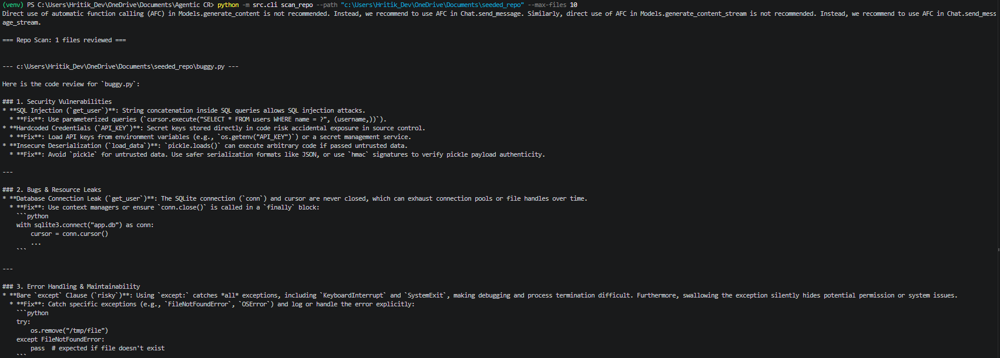

# Baseline Performance Metrics — Phase 1 (No RAG)

Buggy.Py File
--------------

Below is the Screenshot of the terminal run analyzing the file buggy which has forced bugs written into it.




## Seeded Repository
- **Path:** `c:\Users\Hritik_Dev\OneDrive\Documents\Agentic CR\seeded_repo`
- **Known bugs planted:** 4
  1. SQL injection (string concatenation in query)
  2. Hardcoded secret (`API_KEY`)
  3. Unsafe deserialization (`pickle.loads`)
  4. Bare `except` clause / resource leak (unclosed DB connection)


## Scan Command Used
```
python -m src.cli scan_repo --path "c:\Users\Hritik_Dev\OneDrive\Documents\Agentic CR\seeded_repo" --max-files 10
```

## Results

| Metric | Value |
|---|---|
| Files scanned | 1 |
| Known bugs in seeded repo | 4 |
| Bugs correctly found by AI | 4 |
| Total issues reported by AI | 5 |
| **Recall** (found ÷ known) | 1.0(100%) |
| **Precision** (real ÷ reported) | 0.8(80%) |
| **Findings-per-file** (reported ÷ files) | 5 |

## Notes
<!-- Any observations about false positives, missed bugs, or AI behaviour -->
