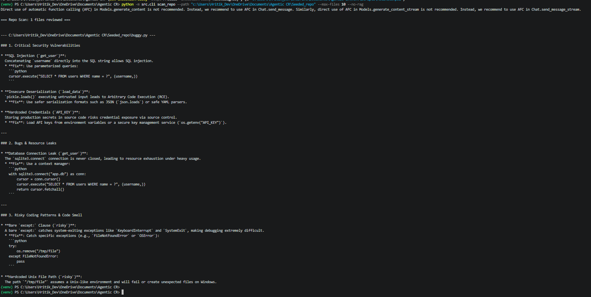
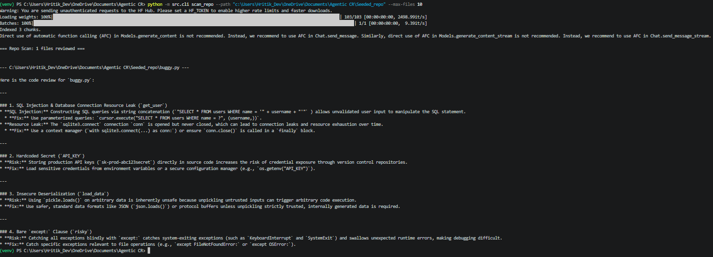
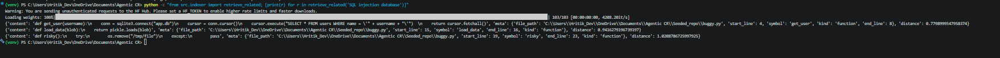

# Performance Metrics — Phase 1 vs Phase 2 (RAG)

## Seeded Repository
- **Path:** `c:\Users\Hritik_Dev\OneDrive\Documents\Agentic CR\Seeded_repo`
- **File scanned:** `buggy.py`
- **Known bugs planted:** 4
  1. SQL injection (string concatenation in query)
  2. Hardcoded secret (`API_KEY`)
  3. Unsafe deserialization (`pickle.loads`)
  4. Bare `except` clause + resource leak (unclosed DB connection)

---

## Scan Commands

**No-RAG (Phase 1 Baseline):**
```
python -m src.cli scan_repo --path "c:\Users\Hritik_Dev\OneDrive\Documents\Agentic CR\Seeded_repo" --max-files 10 --no-rag
```

**With RAG (Phase 2):**
```
python -m src.cli scan_repo --path "c:\Users\Hritik_Dev\OneDrive\Documents\Agentic CR\Seeded_repo" --max-files 10
```

---

## Results

| Metric | Phase 1 (No RAG) | Phase 2 (RAG) |
|---|---|---|
| Files scanned | 1 | 1 |
| Chunks indexed | N/A | 3 |
| Known bugs in seeded repo | 4 | 4 |
| Bugs correctly found by AI | 4 | 4 |
| Total issues reported by AI | 5 | 4 |
| **Recall** (found ÷ known) | 1.0 (100%) | 1.0 (100%) |
| **Precision** (real ÷ reported) | 0.8 (80%) | 1.0 (100%) |
| **Findings-per-file** (reported ÷ files) | 5 | 4 |

> Phase 1 reported 5 issues — the extra one being the hardcoded Unix path `/tmp/file` in `risky()`, which is a valid observation but not one of the 4 planted bugs, hence precision < 100%.
> Phase 2 (RAG) reported exactly 4 issues, all real — precision improved to 100%.

---

## Qualitative Observations

| Dimension | Phase 1 (No RAG) | Phase 2 (RAG) |
|---|---|---|
| Output structure | Grouped by severity (Critical / Bugs / Risky Patterns) | Grouped by function |
| Fix suggestions | Included code snippets | Prose fixes, no code snippets |
| Extra findings | Flagged hardcoded Unix path `/tmp/file` | Did not flag the Unix path |
| Cross-file reasoning | Not applicable | Retrieved 3 chunks, used as context |
| Tone | More assertive | More measured |

---

## Self-Retrieval Bug Note
The `exclude_file` parameter in `retrieve_related()` prevents the file being scanned from retrieving its own chunks as "related context". Without this, the model would receive the file's own code twice — once as the target and once as retrieved context — which would skew the review. This was confirmed present and working in `scan_repo.py`.

---

## Terminal Screenshots

**Phase 1 — No RAG:**



**Phase 2 — With RAG:**



**Chunk Inspection — Retrieved Chunks from `buggy.py`:**


